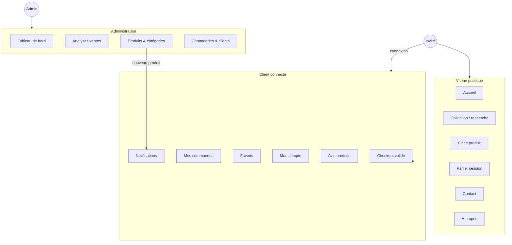

# Cas d'utilisation  -  Boutique PCJ

**Application :** Boutique en ligne PCJ (Laravel  -  Inertia  -  React)  
**Modèle :** mono-boutique  -  acteurs **Client**, **Invité** et **Administrateur**  
**Dernière mise à jour :** juin 2026  -  reflète l'état **implémenté** du dépôt

> Ce document remplace la version sommaire du fichier `cas d'utilisation.pdf` et sert de référence fonctionnelle pour le projet PCJ.

---

## 1. Acteurs

| Acteur | Description |
|--------|-------------|
| **Invité** | Visiteur non connecté : peut parcourir le catalogue, gérer un panier en session, contacter la marque. |
| **Client** | Utilisateur avec rôle `CUSTOMER` : commande, favoris, profil, historique, avis produits. |
| **Administrateur** | Utilisateur avec rôle `ADMIN` : gestion produits, catégories, commandes, clients, analyses. |

**Hors périmètre actuel :** espace **Vendeur** (rôle `VENDOR` présent en base mais sans routes actives).

---

## 2. Cas d'utilisation  -  Client & Invité

### 2.1 Découverte & catalogue

| # | Cas d'utilisation | Acteur | Auth | Statut |
|---|-------------------|--------|------|--------|
| CU-C01 | **Consulter la page d'accueil** (hero, nouveautés, sélection, catégories, témoignages) | Invité / Client | Non | [OK] Implémenté  -  `/` |
| CU-C02 | **Consulter les collections** (catalogue produits) | Invité / Client | Non | [OK] Implémenté  -  `/customer/products` |
| CU-C03 | **Rechercher un produit** (nom, description) | Invité / Client | Non | [OK] Implémenté  -  paramètre `?q=` + barre de recherche header |
| CU-C04 | **Filtrer la collection** (catégorie, couleur, fourchette de prix, tri) | Invité / Client | Non | [OK] Implémenté  -  filtres collection |
| CU-C05 | **Consulter les détails d'un produit** (galerie, prix, description, avis) | Invité / Client | Non | [OK] Implémenté  -  `/customer/products/{id}` |
| CU-C06 | **Personnaliser un produit** (choix couleur, taille, quantité) | Invité / Client | Non | [OK] Implémenté  -  variantes sur fiche produit |
| CU-C07 | **Consulter la page À propos** | Invité / Client | Non | [OK] Implémenté  -  `/about` |

### 2.2 Panier & achat

| # | Cas d'utilisation | Acteur | Auth | Statut |
|---|-------------------|--------|------|--------|
| CU-C08 | **Ajouter un produit au panier** | Invité / Client | Non | [OK] Implémenté  -  bouton panier + tiroir |
| CU-C09 | **Modifier le panier** (quantités, suppression) | Invité / Client | Non | [OK] Implémenté  -  `/customer/cart` + tiroir panier |
| CU-C10 | **Consulter le checkout** (livraison, récapitulatif) | Invité / Client | Non (affichage) | [OK] Implémenté  -  `/customer/checkout` |
| CU-C11 | **Passer une commande** (validation en ligne) | Client | Oui | [OK] Implémenté  -  `POST /customer/checkout` |
| CU-C12 | **Continuer la commande via WhatsApp** | Invité / Client | Non | [OK] Implémenté  -  checkout (message prérempli) ; lien générique sur fiche produit |
| CU-C13 | **Choisir le mode de livraison** (domicile / retrait boutique) | Client | Oui | [OK] Implémenté  -  étape livraison checkout |
| CU-C14 | **Choisir un mode de paiement** (Mobile Money, espèces, WhatsApp) | Client | Oui | [OK] Implémenté  -  étape paiement (sans passerelle réelle) |

**Règle métier :** l'invité peut remplir le checkout mais doit **se connecter** pour valider la commande en ligne.

### 2.3 Compte & authentification

| # | Cas d'utilisation | Acteur | Auth | Statut |
|---|-------------------|--------|------|--------|
| CU-C15 | **Créer un compte client** (2 étapes : infos + date de naissance) | Invité | Non | [OK] Implémenté  -  `/auth/customer/register` |
| CU-C16 | **Se connecter** (email / mot de passe) | Invité | Non | [OK] Implémenté  -  `/auth/login` |
| CU-C17 | **Se connecter avec Google** | Invité | Non | [OK] Implémenté  -  OAuth Google |
| CU-C18 | **Réinitialiser le mot de passe** (OTP email ou téléphone) | Invité | Non | [OK] Implémenté  -  flux OTP |
| CU-C19 | **Vérifier son adresse email** | Client | Oui | [OK] Implémenté  -  Fortify |
| CU-C20 | **Se déconnecter** | Client / Admin | Oui | [OK] Implémenté |

### 2.4 Espace client connecté

| # | Cas d'utilisation | Acteur | Auth | Statut |
|---|-------------------|--------|------|--------|
| CU-C21 | **Gérer son profil** (nom, email, téléphone, avatar) | Client | Oui | [OK] Implémenté  -  `/customer/account`, `/settings/profile` |
| CU-C22 | **Modifier son mot de passe** | Client | Oui | [OK] Implémenté  -  `/settings/security` |
| CU-C23 | **Consulter l'historique des commandes** | Client | Oui | [OK] Implémenté  -  `/customer/orders` |
| CU-C24 | **Consulter le détail d'une commande** | Client | Oui | [OK] Implémenté  -  `/customer/orders/{id}` |
| CU-C25 | **Suivre une commande** (statut affiché) | Client | Oui | [Partiel] Partiel  -  statut en lecture seule ; pas de timeline expédition / livraison |
| CU-C26 | **Ajouter un produit aux favoris** | Client | Oui | [OK] Implémenté  -  cœur catalogue + tiroir favoris |
| CU-C27 | **Consulter ses favoris** | Client | Oui | [OK] Implémenté  -  `/customer/favorites` + tiroir |
| CU-C28 | **Publier un avis produit** (après achat) | Client | Oui | [OK] Implémenté  -  note + commentaire sur fiche produit |
| CU-C29 | **Consulter les notifications** (nouveaux produits) | Invité / Client | Non / Oui | [OK] Implémenté  -  tiroir cloche header |
| CU-C30 | **Marquer les notifications comme lues** | Client | Oui | [OK] Implémenté  -  à l'ouverture du tiroir |
| CU-C31 | **Contacter la marque** | Invité / Client | Non | [OK] Implémenté  -  `/contact` (formulaire email) |
| CU-C32 | **Accéder au menu compte** (tiroir latéral) | Client | Oui | [OK] Implémenté  -  header " Mon compte " |

### 2.5 Non implémenté (prévu UI uniquement)

| Cas d'utilisation | Statut |
|-------------------|--------|
| Mes coupons | [Non] Message " bientôt disponible " |
| Carnet d'adresses | [Non] Message " bientôt disponible " |

---

## 3. Cas d'utilisation  -  Administrateur

Toutes les fonctions admin requièrent : **connexion** + **email vérifié** + rôle **ADMIN**.

### 3.1 Pilotage & analyses

| # | Cas d'utilisation | Statut |
|---|-------------------|--------|
| CU-A01 | **Consulter le tableau de bord** (KPIs, commandes récentes, top produits) | [OK] `/admin/dashboard` |
| CU-A02 | **Analyser les ventes** (jour / semaine / mois / année) | [OK] `/admin/analytics/sales` |
| CU-A03 | **Consulter le chiffre d'affaires, commandes, panier moyen** | [OK] Page analytics |
| CU-A04 | **Identifier les produits les plus vendus** | [OK] Analytics + dashboard |
| CU-A05 | **Identifier les clients les plus actifs** | [OK] Analytics |
| CU-A06 | **Repérer les ruptures à forte demande** | [OK] Analytics |
| CU-A07 | **Suivre les activités commerciales** (graphique d'évolution) | [OK] Graphique CA + commandes |

### 3.2 Produits & collections

| # | Cas d'utilisation | Statut |
|---|-------------------|--------|
| CU-A08 | **Gérer les produits** (liste, création, modification, suppression) | [OK] `/admin/products` |
| CU-A09 | **Gérer les déclinaisons** (couleur × taille, stock par variante) | [OK] Formulaire produit admin |
| CU-A10 | **Filtrer les produits par stock** (en stock, faible, rupture, terminés) | [OK] Onglets produits |
| CU-A11 | **Notifier les clients d'un nouveau produit** | [OK] Notification in-app à la création |
| CU-A12 | **Gérer les collections / catégories** | [OK] `/admin/categories` (CRUD catégories) |

### 3.3 Commandes, clients & stock

| # | Cas d'utilisation | Statut |
|---|-------------------|--------|
| CU-A13 | **Gérer les commandes** (liste globale) | [OK] `/admin/sales/orders` |
| CU-A14 | **Consulter le détail d'une commande** (client, lignes, montant) | [OK] Liste + fiche client |
| CU-A15 | **Modifier le statut d'une commande** | [Non] Non implémenté (lecture seule) |
| CU-A16 | **Gérer les clients** (liste, historique, CA) | [OK] `/admin/sales/customers` |
| CU-A17 | **Gérer le stock** (via produits et variantes) | [OK] Édition stock admin |
| CU-A18 | **Gérer les paiements** (validation, passerelle) | [Non] Non implémenté  -  statuts `PENDING` / `PAID` sans module dédié |
| CU-A19 | **Administrer la plateforme** (navigation, paramètres compte) | [OK] Layout admin + settings |

---

## 4. Diagramme de contexte (simplifié)

---

## 5. Matrice des écarts (PDF initial vs application)

Le PDF historique listait 15 cas client et 9 cas admin. Voici l'alignement :

| PDF (intention) | État dans l'application |
|-----------------|-------------------------|
| Consulter les collections | [OK] |
| Rechercher un produit | [OK] |
| Détails produit | [OK] |
| Personnaliser un produit | [OK] (variantes couleur / taille) |
| Panier | [OK] |
| Favoris | [OK] |
| Compte / connexion | [OK] (+ Google) |
| Commander | [OK] |
| WhatsApp | [OK] (checkout complet ; produit partiel) |
| Suivre commande | [Partiel] Partiel |
| Profil / historique | [OK] |
| Contacter la marque | [OK] |
| Admin  -  produits | [OK] |
| Admin  -  collections | [OK] (catégories) |
| Admin  -  commandes | [OK] (liste) |
| Admin  -  statut commande | [Non] |
| Admin  -  clients | [OK] |
| Admin  -  stock | [OK] |
| Admin  -  paiements | [Non] |
| Admin  -  activités commerciales | [OK] |
| Admin  -  plateforme | [OK] |

---

## 6. Prochaines évolutions recommandées

Pour coller entièrement au cahier des charges historique :

1. **Modifier le statut d'une commande** côté admin (`PENDING` → `PAID` → expédiée → livrée).
2. **Suivi commande client** avec frise de statuts et éventuel numéro de suivi.
3. **Gestion des paiements** (validation manuelle ou intégration Mobile Money / carte).
4. **WhatsApp prérempli** sur la fiche produit (comme au checkout).
5. Harmoniser les **statuts en base** avec ceux affichés dans l'interface.

---

## 7. Références techniques

| Zone | Fichiers clés |
|------|----------------|
| Routes | `routes/web.php`, `routes/settings.php` |
| Client | `app/Http/Controllers/Customer/*`, `resources/js/pages/customer/*` |
| Admin | `app/Http/Controllers/Admin/*`, `resources/js/pages/admin/*` |
| Vitrine | `resources/js/components/storefront/*` |
| Notifications | `CustomerNotificationService`, `notifications-drawer*.tsx` |
| Auth | `routes/web.php` (préfixe `/auth`), Fortify, `GoogleAuthController` |

---

*Document maintenu en Markdown pour versionnement Git. Pour regenerer le PDF : `./docs/build-cas-utilisation-pdf.sh`*
